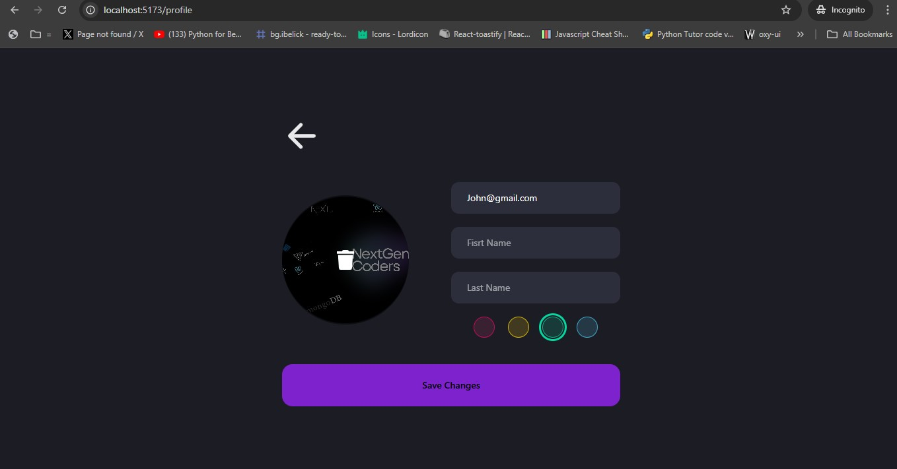

# A-Syncronus Chat Application

A-Syncronus is a real-time chat application built with modern web technologies, providing a seamless and responsive communication experience.

## Demo Images





## Technologies Used

- Frontend:
  - ReactJS
  - Tailwind CSS
  - shadcn/ui

- Backend:
  - Node.js
  - Express.js

- Database:
  - MongoDB

## Features

- Real-time messaging
- User authentication
- Profile customization
- Responsive design
- File sharing

## Getting Started

### Prerequisites

- Node.js
- MongoDB

### Installation

1. Clone the repository
   ```
   git clone https://github.com/yourusername/a-syncronus.git
   cd a-syncronus
   ```

2. Install dependencies
   ```
   cd client && npm install
   cd ../server && npm install
   ```

3. Set up environment variables
   Create `.env` files in both `client` and `server` directories with necessary configurations.

4. Run the application
   ```
   # In the server directory
   npm run dev

   # In the client directory
   npm run dev
   ```

## Contributing

Contributions are welcome! Please feel free to submit a Pull Request.

## License

This project is licensed under the MIT License.
